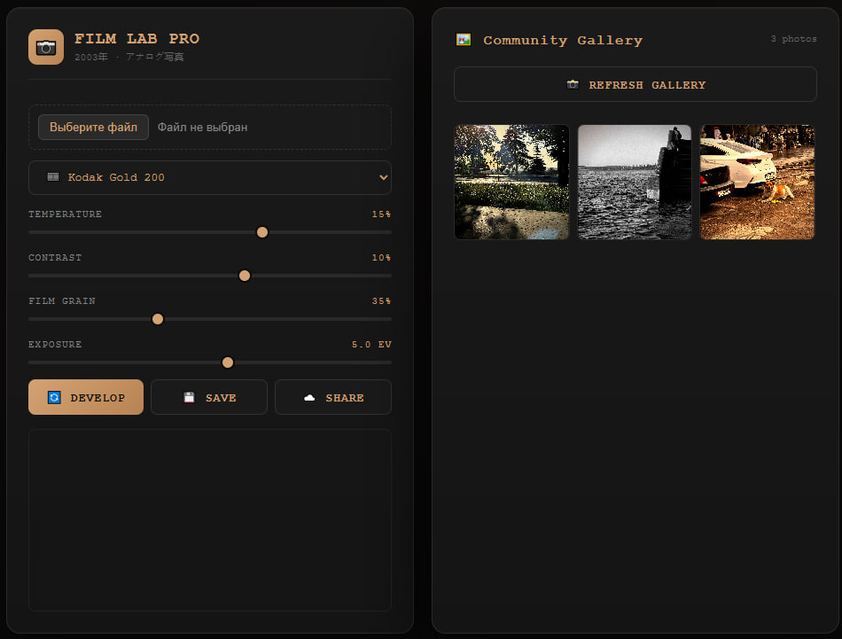

<!-- Заголовок проекта и краткое описание -->
# 🎞️ Film Lab Pro

**Современный онлайн-редактор с эффектами плёночной фотографии.** Обрабатывайте снимки, применяя стили легендарных плёнок, и делитесь результатами в галерее.

[](https://php.net)
[](LICENSE)
[](http://makeapullrequest.com)
[](https://foto.fl0w.ru)

<p align="center">
  
</p>

## ✨ Возможности

*   **Стили под настоящую плёнку**: Эмуляция популярных плёнок: **Kodak Gold 200**, **Fuji Superia 400**, **Cinestill 800T** и ч/б **Ilford HP5 Plus**.
*   **Ручная настройка**: Тонкая регулировка температуры, контраста, зернистости и экспозиции.
*   **Живая галерея**: Публикуйте свои работы в галерее сообщества на сайте.
*   **Локальное хранение**: Все данные хранятся на вашем сервере, что гарантирует полный контроль и безопасность.
*   **Простая установка**: Работает на любом хостинге с поддержкой PHP.

## 🚀 Быстрый старт

1.  Убедитесь, что на вашем сервере установлен PHP версии 8.4 или выше.
2.  Склонируйте репозиторий:
    ```bash
    git clone https://github.com/larin-ilya/film-lab-pro.git
